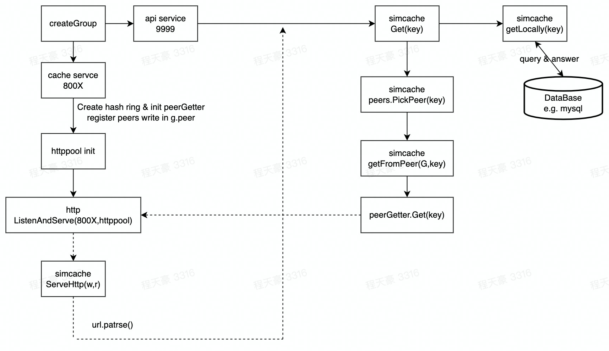

# simcache

* LRU缓存淘汰策略
* 单机并发缓存
* HTTP服务端
* 一致性哈希与分布式节点
* 防止缓存击穿 & 缓存穿透
* protobuf通信

待优化

* sync.mu性能不如sync.map，可将锁机制替换为sync.map，但存在缓存击穿问题，想想怎么省去一些锁
* simcache与httppool虽实现上解耦，但用接口实现关联的方式不太优雅
* 一致性哈希在各节点各自维护，添加节点时所有节点均需更新hash信息，思考能否抽象出hash层，所有节点共用一个hashmap
* 缓存击穿实现上用了太多锁，严格保证了串行化，思考是否能提高效率

参考

* https://github.com/golang/groupcache
